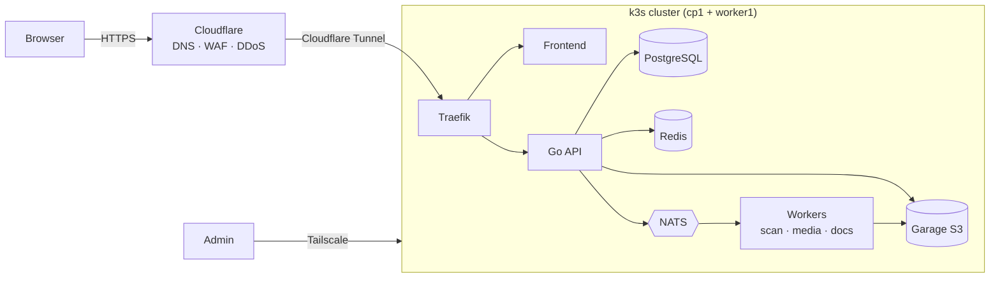

# MyCloud

A self-hosted, multi-tenant personal cloud running on two mini-PCs at home.

Users join with an invite code, sign in with a password plus two-factor authentication (TOTP), and
create up to 5 **spaces** to upload, preview and download images, videos and files. Each account has
a **15 GB** storage quota shared across its spaces.

The project is also a hands-on DevOps platform: Go services, Kubernetes, GitOps and a layered security
setup, all built and run from a home lab.

> **Status:** early development. The CI/CD pipeline and a minimal Go API (`/healthz`, `/readyz`,
> `/version`) are in place. Features are added phase by phase (see [Roadmap](#roadmap)).

## Tech stack

| Area | Technology |
|------|------------|
| Backend | Go (stdlib `net/http`, `log/slog`), pgx + sqlc, goose migrations, OpenAPI (oapi-codegen) |
| Frontend | React + TypeScript (Vite), TanStack Query, React Router, Uppy for resumable uploads |
| Database | PostgreSQL (CloudNativePG operator) for metadata |
| File storage | Garage (S3-compatible object storage) |
| Cache / sessions | Redis |
| Events | NATS JetStream |
| Uploads | tus protocol (resumable, chunked uploads) |
| File processing | ClamAV (malware scan), libvips (images), FFmpeg (video), pdftoppm (PDF) |
| Containers | Docker, distroless base images |
| Orchestration | k3s (lightweight Kubernetes), Traefik ingress |
| CI | GitHub Actions |
| Registry | GitHub Container Registry (GHCR, private) |
| CD | Argo CD + Kustomize (GitOps) |
| Secrets | SOPS + age |
| Networking | Cloudflare (DNS, WAF, Tunnel), Tailscale (admin access) |
| Observability (planned) | Prometheus, Grafana, Loki, Tempo, OpenTelemetry |

## Architecture



- **Single origin:** everything is served from one domain. `/` is the frontend and `/api/*` goes to the
  backend, so there is no CORS and sessions use secure cookies.
- **Files** are stored in object storage under ID-based keys, never under user-supplied names.
- **Uploads** are split into chunks below Cloudflare's 100 MB request limit and can resume after an
  interruption.
- **Every upload is scanned** for malware before it becomes available.

## Project structure

```
myCloud/
├── backend/                   Go API
│   ├── cmd/api/               entry point (main.go)
│   ├── config/                configuration from environment variables
│   ├── internal/
│   │   ├── health/            /healthz and /readyz probes
│   │   ├── auth/              login, 2FA, sessions        (planned)
│   │   ├── user/              user accounts               (planned)
│   │   ├── space/             spaces and quota            (planned)
│   │   ├── file/              file metadata and downloads (planned)
│   │   └── storage/           S3 object storage client    (planned)
│   ├── migrations/            database migrations
│   ├── tests/                 integration tests
│   └── Dockerfile
├── deploy/
│   ├── apps/api/
│   │   ├── base/              Kubernetes Deployment + Service
│   │   └── overlays/          dev / qa / prod settings and image tags
│   └── argocd/                Argo CD project + ApplicationSet
└── .github/workflows/
    ├── backend.yml            test → build → deploy to dev
    └── promote.yml            promote an image dev → qa → prod
```

## Deployment

### Infrastructure

MyCloud runs on a **two-node k3s cluster** of Fujitsu Esprimo Q958 mini-PCs at home:

| Node | Role |
|------|------|
| `cp1` | Kubernetes control plane (also runs workloads) |
| `worker1` | Worker node |

- The home connection has **no public IPv4 and no open ports**. Public traffic reaches the cluster only
  through a **Cloudflare Tunnel**, at `cloud.mohedine.dev`.
- Cluster administration (`kubectl`, SSH) is possible **only over Tailscale**.

### Environments

All three environments run in the same cluster, each in its own namespace:

| Environment | Namespace | How it gets updated |
|-------------|-----------|---------------------|
| dev | `mycloud-dev` | Automatically on every push to `main` |
| qa | `mycloud-qa` | Manually, by promoting the image running in dev |
| prod | `mycloud-prod` | Manually, by promoting the image running in qa (requires approval) |

### CI/CD pipeline

```
push to main ─► test (go vet, go test -race)
             ─► build image ghcr.io/moheddine-belhaj/mycloud-api:sha-<commit>
             ─► commit the new tag to deploy/apps/api/overlays/dev
             ─► Argo CD syncs mycloud-dev

Actions ▸ promote ▸ qa    ─► copy dev's tag to the qa overlay   ─► Argo CD syncs mycloud-qa
Actions ▸ promote ▸ prod  ─► copy qa's tag to the prod overlay  ─► Argo CD syncs mycloud-prod
```

Each image is **built once and promoted**: prod runs the exact image that was tested in dev and qa.
Git is the single source of truth. Argo CD watches `main` and applies whatever the overlays say.

## Run locally

Requires Go 1.26+ (and Docker for the container build).

```bash
cd backend
go test -race ./...
go run ./cmd/api              # listens on :8080 (override with ADDR)

curl localhost:8080/healthz   # {"status":"ok"}
curl localhost:8080/version   # {"version":"dev"}
```

With Docker:

```bash
cd backend
docker build --build-arg VERSION=local -t mycloud-api:local .
docker run --rm -p 8080:8080 mycloud-api:local
```

## Roadmap

| # | Phase | Status |
|---|-------|--------|
| 0 | Platform: k3s cluster, Traefik, Cloudflare Tunnel, Tailscale | In progress |
| 1 | GitOps: CI, GHCR, Argo CD, dev/qa/prod | In progress |
| 2 | Data layer: PostgreSQL, Garage, Redis, NATS, backups | Planned |
| 3 | Auth: invite registration, login, 2FA | Planned |
| 4 | Spaces and quotas | Planned |
| 5 | File upload, listing and download | Planned |
| 6 | Processing pipeline: malware scan, thumbnails, previews | Planned |
| 7 | Security hardening | Planned |
| 8 | Observability: metrics, logs, tracing | Planned |
| 9 | Extras: share links, search, video streaming | Planned |

## Author

Mohedine Belhaj
